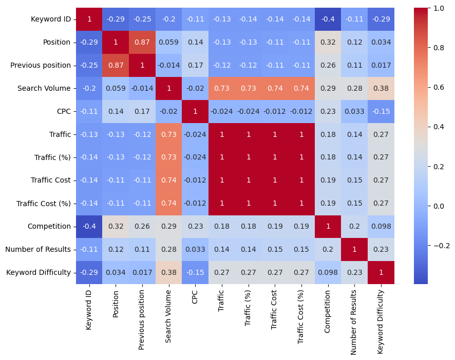
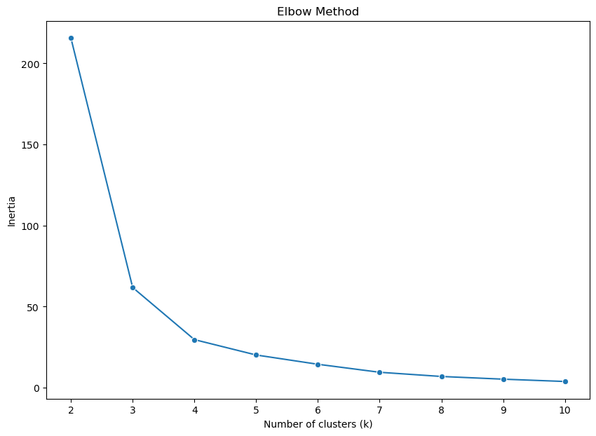
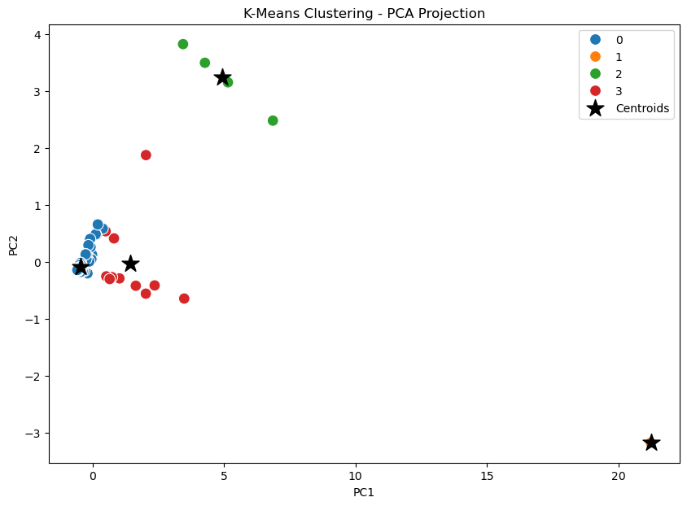

# 📊 K-Means Clustering – Website Traffic Segmentation

This project applies **K-Means Clustering** (unsupervised machine learning) to segment website traffic data into meaningful groups based on metrics like search volume, traffic, and traffic cost.  
The goal is to identify distinct patterns in web traffic behavior for deeper marketing and SEO insights.

---

## 📑 Table of Contents
1. [Project Overview](#-project-overview)
2. [Technologies & Libraries Used](#-tools--technologies)
3. [Dataset](#-dataset)
4. [Project Tree](#-project-tree)
5. [Workflow](#-workflow)
6. [Installation & Usage](#-installation--usage)
7. [Results & Insights](#-results--insights)
8. [License](#-license)
9. [Contributing](#-contributing)
10. [Author](#-author)

---

## 🚀 Project Overview

The notebook `k_means_cluster_web_traffic.ipynb` demonstrates the complete **data science pipeline** for clustering, including:
- Data exploration
- Feature correlation analysis
- Data preprocessing
- Optimal cluster selection using the Elbow Method
- K-Means clustering
- PCA-based 2D visualization of results

---

## 🛠 Technologies & Libraries Used

| Technology                       | Description                                 |
| -------------------------------- | ------------------------------------------- |
| 🐍 **Python**            | Core programming language for analysis and modeling |
| 📓 **Jupyter Notebook**  | Interactive coding and documentation |
| 📊 **pandas**            | Data manipulation and analysis |
| 🔢 **numpy**             | Numerical computations |
| 🤖 **scikit-learn**      | Machine learning library (KMeans, StandardScaler, PCA) |
| 📈 **Seaborn**           | Statistical data visualization |
| 📉 **Matplotlib**        | Plotting and charting |

---

## 📂 Dataset

**File:** `website_traffic_data.csv`  
Contains website keyword metrics including:
- **Search Volume**
- **Traffic**
- **Traffic (%)**
- **Traffic Cost**
- **Traffic Cost (%)**

> Sensitive or irrelevant columns (like IDs) are removed before clustering.

---

## 📂 Project Tree

```
website_traffic_K-Means_ML/
├─ data/
│  ├─ external/
│  │  └─ .gitkeep
│  ├─ interim/
│  │  └─ .gitkeep
│  ├─ processed/
│  │  ├─ .gitkeep
│  │  └─ website_traffic_data.csv
│  └─ raw/
│     └─ .gitkeep
├─ models/
├─ notebooks/
│  ├─ .gitkeep
│  └─ k_means_cluster_web_traffic.ipynb
├─ references/
│  └─ .gitkeep
├─ reports/
│  ├─ figures/
│  │  ├─ .gitkeep
│  │  ├─ cluster_visualization_scatter_plot.png
│  │  ├─ correlation_between_numerical_features.png
│  │  └─ elbow_method.png
│  ├─ .gitkeep
│  └─ webtraffic_clustering_report.pdf
├─ .env.example
├─ .gitignore
├─ LICENCE
├─ README.md
└─ requirements.txt

```

---

## 🛠 Workflow

1. **Data Loading & Inspection**
   - Load dataset using `pandas`
   - Check structure with `.info()` and `.describe()`

2. **Correlation Analysis**
   - Generate a **heatmap** of numeric feature correlations
   - Observations:
     - Search Volume strongly correlates (>0.70) with Traffic, Traffic (%), Traffic Cost, and Traffic Cost (%)
     - Some features show perfect correlation (1.00)
```python
plt.figure(figsize=(10,7))
sns.heatmap(data=df.corr(numeric_only=True), annot=True, cmap='coolwarm')
plt.show()
```


3. **Data Preprocessing**
   - Keep only relevant numeric columns
   ```python
   data = pd.DataFrame(data=df, columns=['Traffic', 'Traffic (%)', 'Traffic Cost', 'Traffic Cost (%)', 'Search Volume'])
   data.head()
   ```
   - Fill missing values with the **median**
   - Standardize features with `StandardScaler`
   ```python
   from sklearn.preprocessing import StandardScaler
   
   scaler = StandardScaler()
   data_scaled = scaler.fit_transform(data)
   ```

4. **Choosing Optimal Clusters**
   - Use **Elbow Method** (inertia vs. k) to find the elbow point
```python
from sklearn.cluster import KMeans

inertia_values = []
cluster_range = range(2, 11)

for k in cluster_range:
    kmeans = KMeans(n_clusters=k, random_state=42, n_init=10)
    kmeans.fit(data_scaled)
    inertia_values.append(kmeans.inertia_)

plt.figure(figsize=(10, 7))
sns.lineplot(x=list(cluster_range), y=inertia_values, marker='o')
plt.title('Elbow Method')
plt.xlabel('Number of clusters (k)')
plt.ylabel('Inertia')
plt.show()
```


5. **Applying K-Means**
   - Train K-Means with the chosen `k`
   ```python
   final_kmeans = KMeans(n_clusters=4, random_state=42, n_init=10)
   final_kmeans.fit(data_scaled)
   labels = final_kmeans.labels_
   ```

6. **Dimensionality Reduction with PCA**
   - Reduce from n-dimensional space to **2D**
   - Assign **Cluster Labels** back to the DataFrame
     ```python
     from sklearn.decomposition import PCA
         
     pca = PCA(n_components=2)
     X_pca = pca.fit_transform(data_scaled.values)
     pca_df = pd.DataFrame(X_pca, columns=['PC1', 'PC2'])
     pca_df['Cluster'] = labels
     pca_df.head()
     ```
   - Transform **centroids** into PCA space for plotting
   ```python
   centroids_pca = pca.transform(final_kmeans.cluster_centers_)
   ```

7. **Visualization**
   - Scatter plot of clusters using **Seaborn**
   - Centroids marked with large black stars
```python
plt.figure(figsize=(10, 7))
sns.scatterplot(data=pca_df, x='PC1', y='PC2', hue='Cluster', palette='tab10', s=100)
plt.scatter(centroids_pca[:, 0], centroids_pca[:, 1], c='black', s=250, marker='*', label='Centroids')
plt.title("K-Means Clustering - PCA Projection")
plt.legend()
plt.show()
```


---

## ▶️ Installation & Usage

1. Clone this repository.
2. Open the `.ipynb` file in **Jupyter Notebook**.
3. Install the required libraries:

```bash
pip install pandas numpy matplotlib seaborn scikit-learn
```

4. Run the notebook cells step-by-step.

---

## 📈 Results & Insights

3 distinct traffic-based clusters were identified:
   - High Traffic / High Value
   - Medium Traffic / Moderate Value
   - Low Traffic / Low Value

Search Volume is the primary driver for other traffic metrics.

---

## 📜 License

This project is licensed under the MIT License.

## 🤝 Contributing

Contributions are welcome! Please fork the repository and submit a pull request.

## 👤 Author

Hi, I'm Hemant, a data enthusiast passionate about turning raw data into meaningful business insights.

📫 **Let’s connect:**
- LinkedIn : [LinkedIn Profile](https://www.linkedin.com/in/hemant1491/)  
- Email : hemant4dsci@gmail.com

---
