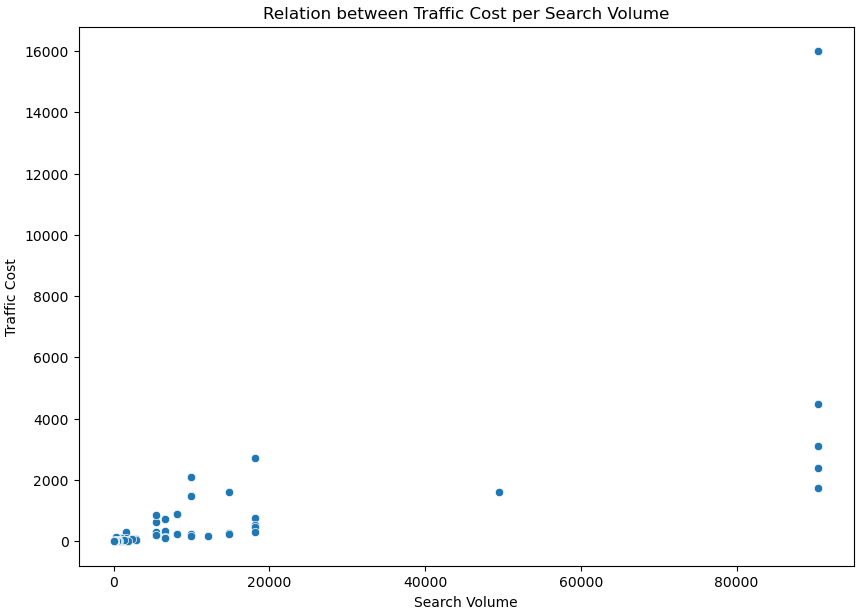
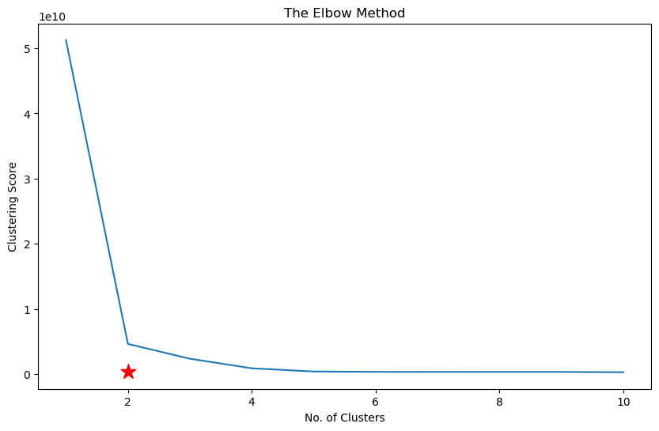
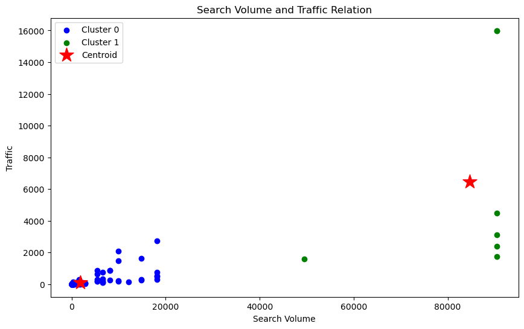

# 📊 K-Means Clustering – Website Traffic Segmentation

This project applies **K-Means Clustering** (unsupervised machine learning) to segment website traffic data into meaningful groups based on metrics like search volume, traffic, and traffic cost.  
The goal is to identify distinct patterns in web traffic behavior for deeper marketing and SEO insights.

---

## 📑 Table of Contents
1. [Project Overview](#-project-overview)
2. [Tools & Technologies](#-tools--technologies)
3. [Dataset](#-dataset)
4. [Workflow](#-workflow)
5. [Installation & Usage](#-installation--usage)
6. [Results & Insights](#-results--insights)
7. [Tech Stack](#-tech-stack)
8. [License](#-license)
9. [Contributing](#-contributing)
10. [Author](#-author)

---

## 🚀 Project Overview

The notebook `k_means_cluster_web_traffic.ipynb` demonstrates the complete **data science pipeline** for clustering, including:
- Data exploration
- Feature correlation analysis
- Data preprocessing
- Optimal cluster selection using the Elbow Method
- K-Means clustering
- PCA-based 2D visualization of results

---

## 🛠 Tools & Technologies
- **Python** – Core programming language for analysis and modeling
- **Jupyter Notebook** – Interactive coding and documentation
- **pandas** – Data manipulation and analysis
- **numpy** – Numerical computations
- **scikit-learn** – Machine learning library (KMeans, StandardScaler, PCA)
- **Seaborn** – Statistical data visualization
- **Matplotlib** – Plotting and charting

---

## 🛠 Technologies & Libraries Used

| Technology                       | Description                                 |
| -------------------------------- | ------------------------------------------- |
| 🐍 **Python**            | Core programming language for analysis and modeling |
| 📓 **Jupyter Notebook**  | Interactive coding and documentation |
| 📊 **pandas**            | Data manipulation and analysis |
| 🔢 **numpy**             | Numerical computations |
| 🤖 **scikit-learn**      | Machine learning library (KMeans, StandardScaler, PCA) |
| 📈 **Seaborn**           | Statistical data visualization |
| 📉 **Matplotlib**        | Plotting and charting |

---

## 📥 Data Loading & Exploration

* The dataset (`website_traffic_data.csv`) is loaded using **Pandas**.
* Basic exploratory data analysis (`head()`, `info()`, `describe()`) is performed to understand the structure and summary statistics of the data.

```python
import os
os.environ["OMP_NUM_THREADS"] = "1"

import pandas as pd
import numpy as np
import matplotlib.pyplot as plt
import seaborn as sns
from sklearn.cluster import KMeans

wtd = pd.read_csv('website_traffic_data.csv')
wtd.head(10)
```
---

## 📊 Data Visualization

* A **scatter plot** is created using **Seaborn** and **Matplotlib** to visualize the relationship between **Search Volume** and **Traffic Cost**.
* This helps in visually inspecting possible natural clusters.
```python
plt.figure(figsize=(10,7))
sns.scatterplot(data=wtd,x='Search Volume',y='Traffic Cost')
plt.xlabel('Search Volume')
plt.ylabel('Traffic Cost')
plt.title('Relation between Traffic Cost per Search Volume')
plt.show()
```

---

## 🔍 K-Means Clustering

* The two key features (**Search Volume** and **Traffic Cost**) are selected and converted into a 2D array for clustering.
* **K-Means clustering** from **scikit-learn** is applied to group the data.
```python
X = wtd.iloc[:, [6,10]].values
X[:5] # Show first 5 records only
```

---

## 📈 Elbow Method for Optimal Clusters

* The **Elbow Method** is used to find the optimal number of clusters by plotting clustering inertia scores for cluster counts from 1 to 10.
* The "elbow point" suggests that **2 clusters** is a good choice.
```python
clustering_score = []
for i in range(1, 11):
    kmeans = KMeans(n_clusters = i, init = 'random', random_state = 42)
    kmeans.fit(X)
    clustering_score.append(kmeans.inertia_) # inertia_ = Sum of squared distances of samples to their closest cluster center.
    

plt.figure(figsize=(10,6))
plt.plot(range(1, 11), clustering_score)
plt.scatter(2,clustering_score[4], s = 200, c = 'red', marker='*')
plt.title('The Elbow Method')
plt.xlabel('No. of Clusters')
plt.ylabel('Clustering Score')
plt.show()
```

---

## 🎨 Cluster Visualization

* K-Means clustering is run with **2 clusters**.
* Cluster labels are added to the dataset.
* A scatter plot is created to visualize the clusters:
```python
plt.figure(figsize=(10,6))
plt.scatter(X[pred == 0, 0], X[pred == 0, 1], c = 'blue', label = 'Cluster 0')
plt.scatter(X[pred == 1, 0], X[pred == 1, 1], c = 'green', label = 'Cluster 1')

plt.scatter(kmeans.cluster_centers_[:,0], kmeans.cluster_centers_[:, 1],s = 300, c = 'red', label = 'Centroid', marker='*')

plt.xlabel('Search Volume')
plt.ylabel('Traffic')
plt.legend()
plt.title('Search Volume and Traffic Relation')
plt.show()
```
  * **Cluster 0**: 🔵 Blue
  * **Cluster 1**: 🟢 Green
  * **Cluster Centroids**: ⭐ Red stars

---

## ▶️ How to Run

1. Clone this repository.
2. Open the `.ipynb` file in **Jupyter Notebook**.
3. Install the required libraries:

```bash
pip install pandas numpy matplotlib seaborn scikit-learn
```

4. Run the notebook cells step-by-step.

---

## ✅ Conclusion

* The clustering reveals distinct groupings in the data based on **Search Volume** and **Traffic Cost**.
* Visualizations help in understanding the separation and central points of the clusters.

---

## 👤 About Me

Hi, I'm Hemant, a data enthusiast passionate about turning raw data into meaningful business insights.

📫 **Let’s connect:**
- LinkedIn : [LinkedIn Profile](https://www.linkedin.com/in/hemant1491/)  
- Email : hemant4dsci@gmail.com

---
